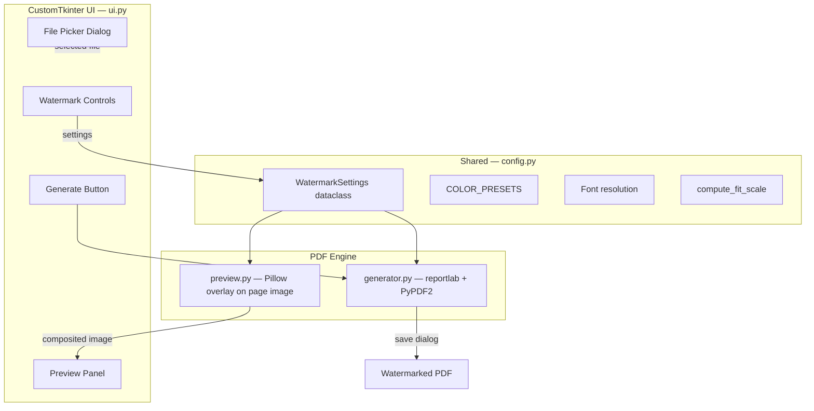

# PDF Watermark Tool — Project Plan

## Overview

A native macOS desktop application that lets users open a PDF, customize a text watermark (content, size, opacity, rotation, color), see a live preview, and export the watermarked PDF. Built with Python and CustomTkinter.

## Architecture



## Tech Stack

| Component | Library | Role |
|-----------|---------|------|
| UI | [CustomTkinter](https://github.com/TomSchimansky/CustomTkinter) | Modern themed Tkinter wrapper |
| PDF rendering (preview) | [PyMuPDF](https://pymupdf.readthedocs.io/) (`fitz`) | Renders PDF pages to PIL images |
| Image compositing (preview) | [Pillow](https://python-pillow.org/) | Draws watermark text onto preview image |
| Watermark creation | [reportlab](https://www.reportlab.com/) | Generates transparent PDF page with watermark |
| PDF merging | [PyPDF2](https://pypdf2.readthedocs.io/) | Overlays watermark onto every page |

## File Structure

```
watermark-app/
├── app.py             # Entry point — launches WatermarkApp
├── ui.py              # CustomTkinter GUI (controls, preview, page navigation)
├── generator.py       # PDF watermark stamping (reportlab + PyPDF2)
├── preview.py         # Pillow-based live preview renderer
├── config.py          # WatermarkSettings, COLOR_PRESETS, font resolution, geometry
├── setup.py           # py2app build config for macOS .app bundle
├── requirements.txt   # Python dependencies
├── README.md          # GitHub-facing project documentation
└── plan.md            # This file — project plan and architecture reference
```

## UI Layout

```
+----------------------------------------------------------+
|  PDF Watermark Tool                              [─ □ ✕]  |
+------------------+---------------------------------------+
|  [Open PDF…]     |                                       |
|                  |                                       |
|  Watermark Text  |                                       |
|  [CONFIDENTIAL ] |          LIVE PREVIEW                 |
|                  |       (current page of PDF             |
|  Font Size       |        with watermark overlay)        |
|  [----●--------] |                                       |
|                  |                                       |
|  Opacity         |                                       |
|  [------●------] |                                       |
|                  |                                       |
|  Rotation        |                                       |
|  [---●---------] |                                       |
|                  |                                       |
|  Color           |                                       |
|  [● Red ▼      ] |                                       |
|                  |                                       |
|  Page [◀ 1/5 ▶] |                                       |
|                  |                                       |
|  [Generate PDF]  |                                       |
+------------------+---------------------------------------+
```

- **Left panel** (~260px, scrollable): File picker, watermark controls, page nav, generate button.
- **Right panel** (fills remaining space): Live preview of the current page with watermark.

## Data Flow

### Live Preview (on every control change)

1. PyMuPDF renders the current page to a PIL Image (cached per page).
2. Image is scaled to fit the preview panel.
3. `preview.render()` composites a semi-transparent, rotated text stamp via Pillow.
4. Result is displayed as a `CTkImage` in the preview label.
5. Updates are debounced (60ms) so sliders feel responsive.

### Watermark Export (on Generate click)

1. Save-as dialog picks the output path.
2. For each page in the original PDF:
   - Read page dimensions from PyPDF2.
   - reportlab creates an in-memory single-page PDF with the watermark (centered, rotated, colored, with opacity).
   - `page.merge_page()` overlays the watermark onto the original page.
3. PyPDF2 writes the merged PDF to disk.
4. Success dialog offers to reveal the file in Finder.

### Overflow Protection

Both the preview and generator use `config.compute_fit_scale()` to shrink the watermark if the rotated text would exceed 85% of the page dimensions. This keeps the watermark fully visible regardless of text length, font size, or rotation.

## Building & Distribution

```bash
# Run from source
python app.py

# Build standalone macOS .app
pip install py2app
python setup.py py2app
cp -R "dist/PDF Watermark Tool.app" /Applications/
```

The py2app build bundles Python, all dependencies, and CustomTkinter's theme assets into a self-contained `.app` that can be launched from Spotlight or the Dock.

## Completed Milestones

- [x] Core dependencies and project setup
- [x] CustomTkinter UI with controls and live preview
- [x] Pillow-based preview renderer with debounced updates
- [x] reportlab + PyPDF2 watermark generation
- [x] Multi-page navigation
- [x] Overflow protection (text auto-scales to fit page)
- [x] Bold font rendering (preview + export)
- [x] py2app macOS .app bundle
- [x] GitHub repo and push

## Future Ideas

- [ ] Tiled/repeated watermark mode (grid of stamps across the page)
- [ ] Image watermark support (logo overlay)
- [ ] Batch processing (watermark multiple PDFs at once)
- [ ] Custom font selection
- [ ] Page range selection (watermark only specific pages)
- [ ] Windows/Linux support
